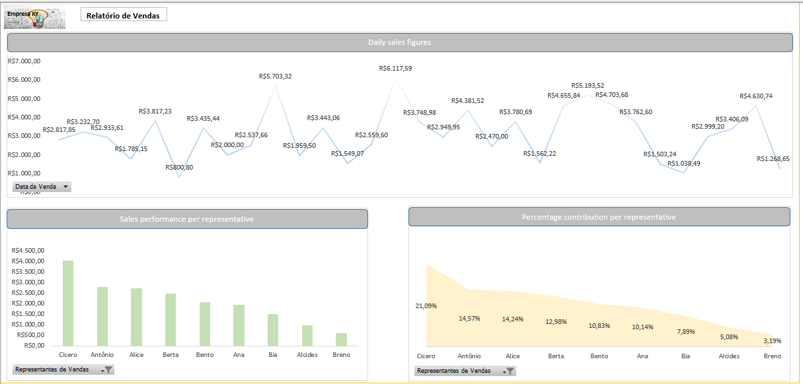

# Analysis Sales Excel

### Overview

In this portfolio, I posed several questions in Excel, utilizing Excel formulas and VBA scripting. Ultimately, I compiled a report containing all the questions and findings, which you can review here: [Analysis_Sales-Excel.xlsb](https://github.com/ElvisRock/Analysis_Sales-Excel/blob/main/Analysis_Sales-Excel.xlsb)

_______________________________________________

Some of the Questions not included in the report, answered in each excel worksheet:

- Determine the total increase in sales
- Determine the new total Payroll
- How many employees received a 3.50% raise?
- Representatives with sales below $100.00 per day will be recommended for a development plan ?

_________________________________

*Points of Analysis in the report*
- Daily sales figures 
- Sales performance per representative   
- Percentage contribution per representative

____________________________________________________

#### Note

In the folder [0-To_Do](https://github.com/ElvisRock/Analysis_Sales-Excel/tree/main/0-To_Do) , you can download the Excel file 'Original', without formulas, without a report, and you can use it for practice. 

In the text file [Script_VBA.txt](https://github.com/ElvisRock/Analysis_Sales-Excel/blob/main/Script_VBA.txt), there are VBA scripts with comments explaining what each one does. To directly access Excel's VBA, use the shortcut ALT+F11. If it doesn't work, enable the 'DEVELOPER' tab in Excel.
______________________________

______________________________
Docs from reference: [Office VBA](https://learn.microsoft.com/pt-br/office/vba/api/overview/)
